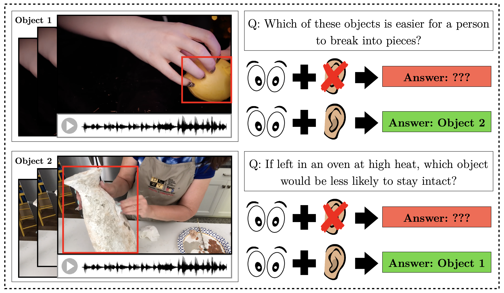

# PACS: A Dataset for Physical Audiovisual Common-Sense Reasoning

This repository contains data and code for our paper [PACS: A Dataset for Physical Audiovisual CommonSense Reasoning](https://arxiv.org/pdf/2203.11130.pdf). 



## Setting up the Repository

It is recommended to create an Anaconda environment:

```
conda create --name PACS python=3.8.11
conda activate PACS
pip install -r requirements.txt
```

Then, install the correct version of PyTorch, based on your cuda version [here](https://pytorch.org/get-started/locally/). For example:

```
pip3 install torch==1.11.0+cu113 torchvision==0.12.0+cu113 torchaudio==0.11.0+cu113 -f https://download.pytorch.org/whl/cu113/torch_stable.html
```
## Dataset Download

The dataset is available for download [here](https://drive.google.com/drive/folders/1TjOKBTU9dsytHJIb919V4wXFR1Zm5TsJ?usp=sharing).

Alternatively, if you want to replicate the original download steps, you can run the following code (this will take a while):

```
cd dataset/scripts
python3 download.py -data_dir PATH_TO_DATA_STORAGE_HERE
python3 preprocess.py -data_dir PATH_TO_DATA_STORAGE_HERE
```

## Baseline Models

To run baseline models, visit the experiments folder. We have currently benchmarked the following models:

| **Model**                                                                                     | **With Audio (%)** | **Without Audio (%)** | **Δ** |
|-----------------------------------------------------------------------------------------------|:--------------------:|:-----------------------:|:--------------:|
| Fusion (I+A+V)                                                                                | 51.9 ± 1.1     | -                     | -            |
| Fusion (Q+I)                                                                                  | -                  | 51.2 ± 0.8        | -            |
| Fusion (Q+A)                                                                                  | 50.9 ± 0.6     | -                     | -            |
| Fusion (Q+V)                                                                                  | -                  | 51.5 ± 0.9        | -            |
| Late Fusion                                                                                   | 55.0 ± 1.1     | 52.5± 1.6         | 2.5          |
| [CLIP](https://github.com/openai/CLIP)/[AudioCLIP](https://github.com/AndreyGuzhov/AudioCLIP) | 60.0 ± 0.9     | 56.3 ± 0.7        | 3.7          |
| [UNITER](https://github.com/ChenRocks/UNITER) (L)                                             | -                  | 60.6 ± 2.2        | -            |
| [Merlot Reserve](https://github.com/rowanz/merlot_reserve) (B)                                | 66.5 ± 1.4     | 64.0 ± 0.9        | 2.6          |
| [Merlot Reserve](https://github.com/rowanz/merlot_reserve) (L)                                | 70.1 ± 1.0     | 68.4 ± 0.7        | 1.8          |
| Majority                                                                                      | 50.4               | 50.4                  | -            |
| Human                                                                                         | 96.3 ± 2.1     | 90.5 ± 3.1        | 5.9          |

## Citation

If you used this repository, please consider citing us:

```
@misc{yu2022pacs,
      title={PACS: A Dataset for Physical Audiovisual CommonSense Reasoning}, 
      author={Samuel Yu and Peter Wu and Paul Pu Liang and Ruslan Salakhutdinov and Louis-Philippe Morency},
      year={2022},
      eprint={2203.11130},
      archivePrefix={arXiv},
      primaryClass={cs.LG}
}
```
